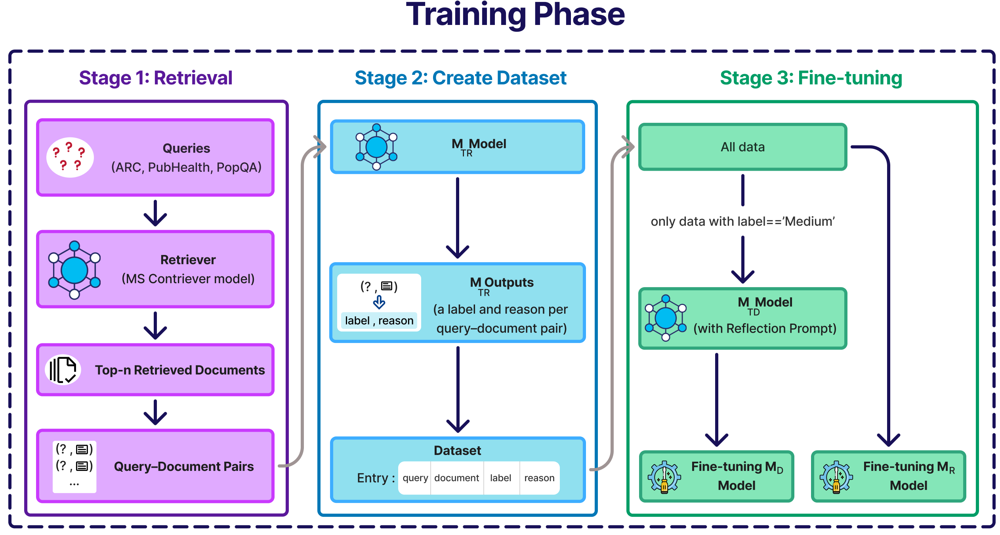
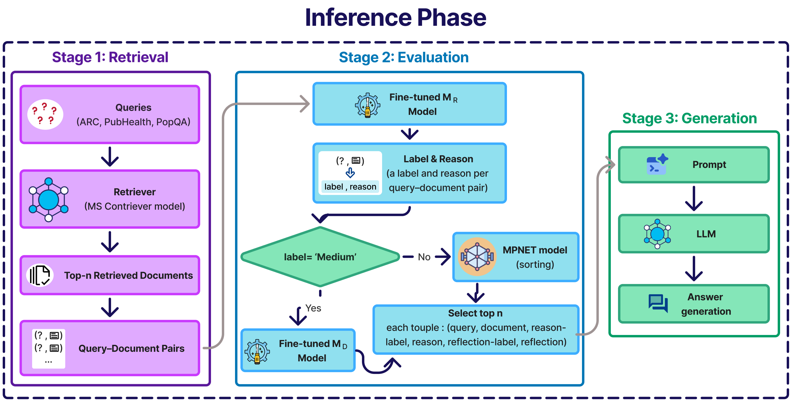

# Rationale-Driven RAG

This repository contains the implementation of our paper:

**“Rationale-Only Context: Distilled Graded-Utility Evaluation for Noise-Robust Short-Answer RAG”**

The proposed approach introduces **Rationale-Driven Context**, a method that transforms retrieved documents into concise rationales before using them as context in a Retrieval-Augmented Generation (RAG) pipeline. The method is designed to improve robustness to noisy retrieval results, particularly for **short-answer question-answering datasets**.

> **Note:** This repository is currently under development and will be fully completed following the publication of the paper.

## Overview

The overall framework consists of two main phases:

### Training Phase

The training pipeline is illustrated below:



### Test Phase

The inference and evaluation pipeline is illustrated below:



## How to Run

Before running the notebooks, make sure you are working from the **root directory of the repository**.

### 1. Prepare the datasets

Place the required dataset JSON files in:

```text
src/Dataset/eval_data/
```

### 2. Prepare the fine-tuned models

Place the required **LoRA weight files** in:

```text
fine-tuned-models/
```

### 3. Run the notebooks

Open and run the notebooks from the root directory of the project.

> **Important:** The required datasets, LoRA weights, and other experimental artifacts can be downloaded from the links provided in the [Downloadables](#downloadables) section.

## Downloadables

The following resources are provided to facilitate the reproduction of our experiments and to support future research:

* **[Generated Rationales, Reflections, Datasets, LLM Generations, and Models](https://drive.google.com/drive/folders/1W0PQKCnY7RuuSTcryfT_kst7uc3aJyDS?usp=sharing)**

  * Generated rationales and reflections
  * Processed datasets
  * LLM generations
  * Model files and related artifacts

* **[Training Retrievals](https://drive.google.com/drive/folders/19a3DlYQiuqvNjewgihgMwKPMU8b01oHe?usp=sharing)**

  * Retrieval results used during the training process

* **[Web Search Results](https://drive.google.com/drive/folders/1cJgFPr8dXOEKAkCpuXf5ed_qHG4XV7HR?usp=sharing)**

  * Web search results used in our experiments

## References and Acknowledgements

This work builds upon our previous research project, **MG-CRAG**:

* **[MG-CRAG](https://github.com/LLM-Research-LAB/mg-crag)**

We would also like to thank the authors of the following open-source projects, which contributed to different parts of our implementation:

* **[Self-RAG](https://github.com/AkariAsai/self-rag)** — Retrieval implementation using Contriever
* **[CRAG](https://github.com/HuskyInSalt/CRAG)** — Prompts and other CRAG-related configurations
* **[Corrective-RAG by Grecil](https://github.com/Grecil/Corrective-RAG)** — Project structure and LangGraph implementation

## Citation

The citation information will be added after the publication of the paper.

```bibtex
<!-- Citation will be added here after publication. -->
```
